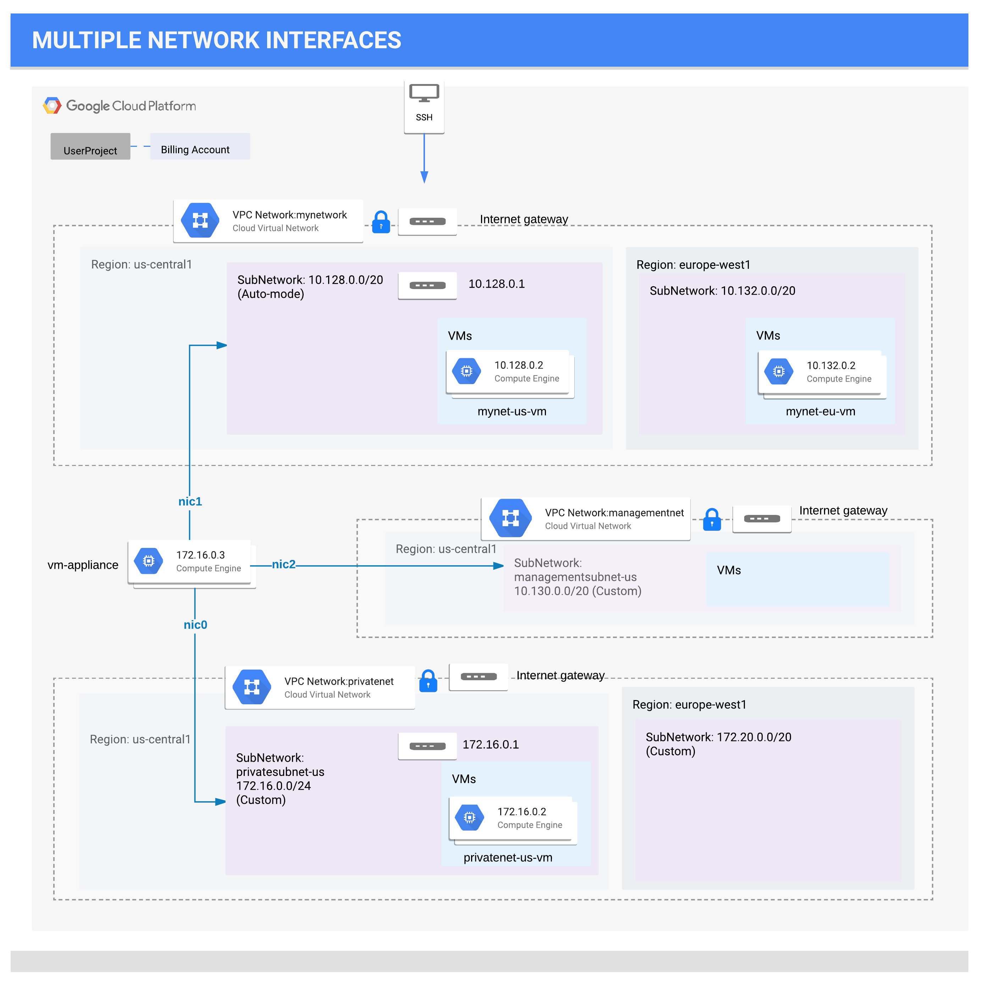

# GCP

## Networking

### Images

#### GCP Multi VPC



#### GCP VPC Load Balancing


---

### VPC Networking Fundamentals

- **_A VPC network consists of subnets, routes and firewall rules_**
- **VPC Network CIDR can be as large as /9 and doesn't require CIDR to be defined**
- **Subnets** are regional, ie. spans across **Zones**, have a private RFC 1918 CIDR block of **/20** and a **gateway** which reserves **First IP address** of the CIDR block
- **Routes** tell VM instances and the VPC network how to send traffic from an instance to destination. Without a VPC network there are no routes.
- **Firewall** rules controls which packets are allowed to travel to which destinations
  - Firewall rules are applied based on **priority**. Higher integer corresponds to lower priority.
  - Each VPC network has 2 implied firewall rules: viz.
    1. **ingress deny all**. Priority 65535
    2. **egress allow all**. Priority 65535
  - Default ingress in default vpc
    1. **default-allow-{icmp,rdp,ssh}** from 0.0.0.0/0. Priority 65534
    2. **default-allow-internal** tcp, udp, icmp within VPC CIDR. Priority 65534
  - _RDP port 3389_
- **Default Internet Gateway** ≡ 0.0.0.0/0
- **External IP addresses** for instances are ephemeral and are released once a instance stops.
- **Static External IP Address** are reserve addresses assigned to a project until released explicitly.
- **SSH Connection** GCE generates SSH Key and stores it in:
  - By Default, add the generated key to project or instance metadata
  - If account is configured with **OS Login**, key is stored in user account
  - Alternatively, keys can be created and added to **public ssh key metadata** of an instance
- VPC network has internal DNS service. **An instance name can be used as internal DNS Name to access the instance other than internal IP address and external IP address**. `ping -c 3 mynet-eu-vm`
- Deleting a VPC network order
  1. Deletes firewall rules
  2. Deletes Routes
  3. Deletes Network
- Auto-mode network create subnets in each region automatically while custom starts with no subnets
- Access to instances with external ip addresses is only controlled by the ICMP firewall rules

### Multiple VPC Networks

- An instance can have **Multiple Network Interfaces (NIC)** based on instance type **(upto 8 NIC)** which enables connections to multiple VPC networks based on configuration
- VMs with multiple network interface controllers (NICs) **can't(?) be part of subnets with overlapping CIDR**
- **Internal DNS query** for instance hostname **resolves to the primary interface (nic0)** of the instance
- NICs get route to for the subnet it is in. In addition, the instance gets a single default route that is associated with the primary interface eth0.
- Unless manually configured otherwise, any traffic leaving an instance for any destination other than a directly connected subnet will leave the instance via the default route on eth0.

### VPC Networks - Controlling Access

- Instance Creation: Networks use network tags to identify which VM instances are subject to certain firewall rules and network routes. Later in this lab, you create a firewall rule to allow HTTP access for VM instances with the web-server tag. Alternatively, you could check the Allow HTTP traffic checkbox, which would tag this instance as http-server and create the tagged firewall rule for tcp:80 for you.
- VM get default service account [PROJECT_NUMBER]-compute@developer.gserviceaccount.com.
  - 2 type of Service Accounts:
    1. User-managed service accounts
    2. Google-managed service accounts ([PROJECT_NUMBER]-compute@developer.gserviceaccount.com) with Cloud IAM project editor role.
  - VM's Default Service Account doesn't have Network Admin Role and thus can't affect firewall and SSL certificates
- To activate a service account: Create a service account -> Assign role eg. Compute Security Admin -> Create Key -> Download json and rename to credentials.json -> `gcloud auth activate-service-account --key-file credentials.json`

#### IAM

- Network Admin: Permissions to create, modify, and delete networking resources, except for firewall rules and SSL certificates. Provide listing of firewall resources
- Security Admin: Permissions to create, modify, and delete firewall rules and SSL certificates

### HTTP Load Balancer with Cloud Armor

- Use `siege` to stress test network load balancing
- GCP implements **HTTP(S) Loadbalancers** at edge location aka. point of presence **(POP)**
- **Cloud Armor provides IP whitelisting/blacklisting** to filter traffic to LBs.
- **Healthcheck probes** to loadbalanced instances comes from **130.211.0.0/22 and 35.191.0.0/16**
- **Managed Instance Groups** uses **Instance Templates** to create group of identical instances
- **Instance Groups** aws-aka. **AutoScaling Groups** use instance templates to to launch identical VMs based on load. They can be **created for a region or zone**
- **_startup-script-url_** awk-aka. **_user-data_**
- **_The Hostname and Server Location identifies where the HTTP Load Balancer sends traffic_**

---

## Useful Commands

Command structure `gcloud service [subservice(s)] action [name] --options`. subservices are mentioned in plural form

```sh
# get help
gcloud help compute instances create

# setup gcloud
gcloud init
gcloud init --project qwiklabs-gcp-00-190ccec93406

# active account name
gcloud auth list

# list the project ID
gcloud config list project

# Project Quota
gcloud compute project-info describe --project <project-id>

# check whether the server is ready for an RDP connection

# create a custom vpc network
gcloud compute --project=qwiklabs-gcp-00-cf97919dc2f9 networks create managementnet --subnet-mode=custom

# create a subnet in custom mode vpc network, subnet is regional defined by a CIDR in a VPC
gcloud compute networks subnets create managementsubnet-us --network=managementnet --region=us-central1 --range=10.130.0.0/20

# Add firewall rules to network, a firewall rule for a network is defined as source, direction, action, rule, priority
gcloud compute firewall-rules create managementnet-allow-icmp-ssh-rdp --direction=INGRESS --priority=1000 --network=managementnet --action=ALLOW --rules=tcp:22,tcp:3389,icmp --source-ranges=0.0.0.0/0

# create an instance in a network, machine-type, zone and subnet is important
gcloud compute instances create privatenet-us-vm --zone=us-central1-c --machine-type=n1-standard-1 --subnet=managementsubnet-us

# list routes of an instance
ip route

# tag an instance
gcloud compute instances add-tags blue --tags=web-server

# create a firewall rule to target an instance
gcloud compute firewall-rules create allow-http-web-server --allow=tcp:80,icmp --network default --priority 1000 --source-ranges 0.0.0.0/0 --direction INGRESS --target-tags web-server

# create healthcheck firewall rules
gcloud compute firewall-rules create default-allow-health-check --direction INGRESS --allow tcp --source-ranges=130.211.0.0/22,35.191.0.0/16 --target-tags http-server --network default

# create an instance template
gcloud compute instance-templates create us-east1-template --metadata startup-script-url=gs://cloud-training/gcpnet/httplb/startup.sh --network default --tags http-server

# create an instance group
gcloud compute instance-groups managed create us-east1-mig --template us-east1-template --size 1 --region us-east1

# set autoscaling in instance group
gcloud compute instance-groups managed set-autoscaling us-east1-mig --min-num-replicas 1 --max-num-replicas 5 --cool-down-period 45 --target-cpu-utilization 0.80

# enable osLogin to an instance
gcloud compute instances add-metadata instance-name --metadata enable-oslogin=TRUE

# ssh osLogin to an instance
gcloud compute ssh instance-name

```

---

## Google Cloud Platform Fundamentals: Core Infrastructure

### Introduction

- **GCP**: Cloud based products and services = Infra + Platform + Software = Compute + Storage + Networking + BigData + Machine Learning = CSNBiM + G Suite + G Devices + Stackdriver, etc
- **Cloud Computing**: On-Demand + Broad Network Access + Resource Pooling + Elasticity + Measured Services (_Pay per use_)
- **History `<->` Future**: On Perm `->` Virtual `->` Serverless
- **Compute**: (Managed Infra) `<-` Compute Engine (_IaaS_) `-` Kubernetes Engine (_Hybrid_) `-` App Engine (_PaaS_) `-` Cloud Functions (_Serverless_) `-` Managed Services (_Automated Elastic Resource_) `->` (Dynamic Infra)
- Global -> Multi Region -> Region (_Each region separated by 160KM/100Miles_) -> Zones (_Think of them as separate facilities_)
- Environmental Concerns - 0 Carbon Emission and 100% Renewable Energy
- Encryption at Rest, In Transition, DDoS, Google Frontend Test for Vulnerabilities
- Built on **OpenAPIs** like kubernetes, Hadoop, Apache HBase which are opensource
- Encryption at Rest, In Transition, DDoS, Google Frontend Test for Vulnerabilities
- Project Number (_Auto-generated can't change_), Project ID _auto-generated, can be changed at time of creation only_, Project Name _user provided, NOT Globally unique_
- Project in gshell can be changed by `gcloud config set project <PROJECT_ID>`, current project is set in `$DEVSHELL_PROJECT_ID` `env` variable
  - `gcloud config list`
  - `gcloud config core list`

### Cloud Platform Hierarchy

- Compute Resources, IAM, least privilige, raw compute to managed services, access using web console/cli-tools(_G Cloud SDK preinstalled, gsutil, bq, gcloud_)/iOS/Android/APIs
- Resources are allocated based on **PROJECTS** which can be grouped under **FOLDERS**
- Organization Nodes -> Folders (_It is must to have org node to create folders_) -> Projects -> GCP Resources
  - Policies are inherited from top (eg. Org node), with more generous of them taking precedence (_consider it binary OR of access level_)
  - Org node can be create by using Cloud Identity
  - [?] _Billing is per project basis_

### IAM

- who (_person|group|application_) -> can do what (_previliges|actions_)-> on which resources (_GCP Services_)?
- Organization -= Folders -= Projects -= Members -= Roles -= Resources -= Products -= G Suit Super Admins
- Policy is set on resource comprises of **Roles and Role Members**
- Policies|Permission are **inherited top to down and is union of all policies** in the hierarchy with **less restrictive policy overriding restrictive policy**
- - _Follow principle of least privilege_

---

## Must Review

### Physical Infrastructure

Global System (_Internet_) `->` Points of Presence (_Edge Locations and CDNs_)
`->` Global (_Private Global Network_)
`->` Multi Region
`->` Region (_Each region separated by 160KM/100Miles_)
`->` Zones (_Think of them as separate facilities_)
`->` Datacenters
`->` Rack
`->` Physical Server
`->` vCPU (**2vCPU = 1 core**)

### Cloud Platform Hierarchy

- Organization Nodes `->` Folders (_It is must to have org node to create folders_) `->` Projects `->` GCP Resources
  - Policies are inherited from top (eg. Org node), with more generous of them taking precedence (_consider it binary OR of access level_)
  - Org node can be create by using Cloud Identity
  - Billing is per project basis
- Compute Resources, IAM, least privilege, raw compute to managed services, access using web console/cli-tools/iOS/Android/APIs
- Resources are allocated based on **PROJECTS** which can be grouped under **FOLDERS**

### Network Ingress and Egress

- **Normal Network**: Routes via internet to edge location _closets to destination_, available at _lower price_
- **Google**: Routes so traffic enters from @edge _closest to source_
  - Single global IP address and Loadbalancers worldwide
  - _AWS only supports Normal network_

### Pricing

- **Network Traffic**: Ingress Free, Egress charged per GB
  - _egress to a gcp service in a region is sometimes free_
- **Services**: Usage, Provisioned
- **Discounts**: Pay by second, Sustained Use discount, Customize compute resources or use out of box

### Security

- Separation of duties
- Encryption at rest, in transition even within gcp network, DDoS, Google Frontend Test for Vulnerabilities
- _Recommends: Distrust the network_

---

## Resources

- [Sample Architectures](http://gcp.solutions/)
- [API Hosting](http://gcp.solutions/diagram/API%20Hosting)
- [Jenkins on Kubernetes](http://gcp.solutions/diagram/Jenkins%20on%20k8s)
- [Live Streaming](http://gcp.solutions/diagram/Live%20Streaming)
- [Log Processing](http://gcp.solutions/diagram/Log%20Processing)
- [Shopping Cart Analysis](http://gcp.solutions/diagram/Shopping%20Cart%20Analysis)
- [Network Map](https://cloud.google.com/about/locations/#network-tab)
- [Regions Map](https://cloud.google.com/about/locations/#regions-tab)
- [Apigee API Platform](https://cloud.google.com/apigee-api-management/)
- [App Engine (GAE)](https://cloud.google.com/appengine/)
- [Using Stackdriver Logging in App Engine apps App Engine Documentation](https://cloud.google.com/appengine/articles/logging)
- [Reading and Writing Application Logs App Engine standard environment for Python](https://cloud.google.com/appengine/docs/standard/python/logs/)
- [BeyondCorp](https://cloud.google.com/beyondcorp/)
- [BigQuery](https://cloud.google.com/bigquery/)
- [Using the bq Command-Line Tool BigQuery](https://cloud.google.com/bigquery/docs/bq-command-line-tool)
- [Bigtable - Scalable NoSQL Database Service Cloud Bigtable](https://cloud.google.com/bigtable/)
- [Cloud Billing API](https://cloud.google.com/billing/docs/)
- [Billing Access Docs](https://cloud.google.com/billing/docs/how-to/billing-access)
- [GCP Docs on Budgets and Billing Alerts](https://cloud.google.com/billing/docs/how-to/budgets)
- [GCP Docs on Billing Export to BigQuery](https://cloud.google.com/billing/docs/how-to/export-data-bigquery)
- [BigQuery Under the Hood](https://cloud.google.com/blog/big-data/2016/01/bigquery-under-the-hood)
- [Dataflow Shuffle](https://cloud.google.com/blog/big-data/2017/06/introducing-cloud-dataflow-shuffle-for-up-to-5x-performance-improvement-in-data-analytic-pipelines)
- [GPUs in Kubernetes Engine now available in beta](https://cloud.google.com/blog/products/gcp/accelerate-highly-parallelized-compute-tasks-with-gpus-in-kubernetes-engine)
- [Cloud CDN](https://cloud.google.com/cdn/)
- [Google Certified Professional Cloud Architect](https://cloud.google.com/certification/cloud-architect)
- [Compute Engine (GCE)](https://cloud.google.com/compute/)
- [Service Accounts and Scopes](https://cloud.google.com/compute/docs/access/create-enable-service-accounts-for-instances)
- [Service Accounts Compute Engine Documentation](https://cloud.google.com/compute/docs/access/service-accounts)
- [Viewing Audit Logs Compute Engine Documentation](https://cloud.google.com/compute/docs/audit-logging)
- [Local SSD](https://cloud.google.com/compute/docs/disks/#localssds)
- [GCE Instance Statuses](https://cloud.google.com/compute/docs/instances/checking-instance-status)
- [Creating Instances](https://cloud.google.com/compute/docs/instances/create-start-instance)
- [Preemptible Instances](https://cloud.google.com/compute/docs/instances/create-start-preemptible-instance)
- [Creating a VM Instance with a Custom Machine Type Compute Engine Documentation](https://cloud.google.com/compute/docs/instances/creating-instance-with-custom-machine-type)
- [Static IPs](https://cloud.google.com/compute/docs/ip-addresses/reserve-static-external-ip-address)
- [Global Load Balancing](https://cloud.google.com/compute/docs/load-balancing/http/)
- [Machine Types Compute Engine Documentation](https://cloud.google.com/compute/docs/machine-types)
- [Regions and Zones Docs](https://cloud.google.com/compute/docs/regions-zones/)
- [Changing the Default Region or Zone Compute Engine Documentation](https://cloud.google.com/compute/docs/regions-zones/changing-default-zone-region)
- [Startup Scripts](https://cloud.google.com/compute/docs/startupscript)
- [Instance Metadata Reference](https://cloud.google.com/compute/docs/storing-retrieving-metadata)
- [Storing and Retrieving Instance Metadata](https://cloud.google.com/compute/docs/storing-retrieving-metadata)
- [Long-Polling for Metadata Changes](https://cloud.google.com/compute/docs/storing-retrieving-metadata#waitforchange)
- [Cloud VPN](https://cloud.google.com/compute/docs/vpn/overview)
- [Network Pricing](https://cloud.google.com/compute/pricing#network)
- [Resource Quotas (Soft Limits)](https://cloud.google.com/compute/quotas)
- [Container Builder](https://cloud.google.com/container-builder/)
- [Container Registry (GCR)](https://cloud.google.com/container-registry/)
- [Cloud Data Studio](https://cloud.google.com/data-studio/)
- [Cloud Dataflow - Stream &amp; Batch Data Processing Cloud Dataflow](https://cloud.google.com/dataflow/)
- [Cloud Datalab](https://cloud.google.com/datalab/)
- [Cloud Dataprep](https://cloud.google.com/dataprep/)
- [Cloud Dataproc - Cloud-native Apache Hadoop &amp; Apache Spark Cloud Dataproc](https://cloud.google.com/dataproc/)
- [Cloud Datastore](https://cloud.google.com/datastore/)
- [Cloud Datastore Queries](https://cloud.google.com/datastore/docs/concepts/queries)
- [Stackdriver Debugger](https://cloud.google.com/debugger/)
- [Cloud Deployment Manager](https://cloud.google.com/deployment-manager/)
- [Dialogflow](https://cloud.google.com/dialogflow-enterprise/)
- [Cloud Data Loss Prevention (DLP) API](https://cloud.google.com/dlp/)
- [Cloud DNS](https://cloud.google.com/dns/)
- [Main Documentation](https://cloud.google.com/docs/)
- [Geography and Regions Documentation](https://cloud.google.com/docs/geography-and-regions)
- [Tutorials](https://cloud.google.com/docs/tutorials)
- [Cloud Endpoints](https://cloud.google.com/endpoints/)
- [Cloud Endpoints gRPC Transcoding](https://cloud.google.com/endpoints/docs/grpc/transcoding)
- [Cloud Endpoints Architecture](https://cloud.google.com/endpoints/docs/openapi/architecture-overview)
- [Stackdriver Error Reporting](https://cloud.google.com/error-reporting/)
- [Cloud Functions (GCF)](https://cloud.google.com/functions/)
- [Cloud Genomics](https://cloud.google.com/genomics/)
- [Cloud Identity and Access Management (IAM)](https://cloud.google.com/iam/)
- [Granting Roles to Service Accounts](https://cloud.google.com/iam/docs/granting-roles-to-service-accounts)
- [Overview](https://cloud.google.com/iam/docs/overview)
- [Hierarchical Access Control](https://cloud.google.com/iam/docs/resource-hierarchy-access-control)
- [Service Accounts](https://cloud.google.com/iam/docs/service-accounts)
- [Understanding Roles](https://cloud.google.com/iam/docs/understanding-roles)
- [Understanding Service Accounts](https://cloud.google.com/iam/docs/understanding-service-accounts)
- [Cloud Identity-Aware Proxy (IAP)](https://cloud.google.com/iap/)
- [Cloud Interconnect](https://cloud.google.com/interconnect/)
- [Dedicated Interconnect](https://cloud.google.com/interconnect/docs/details/dedicated)
- [CDN Interconnect](https://cloud.google.com/interconnect/docs/how-to/cdn-interconnect)
- [Cloud Internet of Things (IoT) Core](https://cloud.google.com/iot-core/)
- [Cloud Job Discovery](https://cloud.google.com/job-discovery/)
- [Cloud Key Management Service (KMS)](https://cloud.google.com/kms/)
- [Kubernetes Engine (GKE)](https://cloud.google.com/kubernetes-engine/)
- [Cluster Architecture Kubernetes Engine](https://cloud.google.com/kubernetes-engine/docs/concepts/cluster-architecture)
- [DaemonSet Kubernetes Engine](https://cloud.google.com/kubernetes-engine/docs/concepts/daemonset)
- [Deployment Kubernetes Engine](https://cloud.google.com/kubernetes-engine/docs/concepts/deployment)
- [Pod Kubernetes Engine](https://cloud.google.com/kubernetes-engine/docs/concepts/pod)
- [StatefulSet Kubernetes Engine](https://cloud.google.com/kubernetes-engine/docs/concepts/statefulset)
- [Logging Kubernetes Engine](https://cloud.google.com/kubernetes-engine/docs/how-to/logging)
- [Resizing a Cluster Kubernetes Engine](https://cloud.google.com/kubernetes-engine/docs/how-to/resizing-a-cluster)
- [Cloud Load Balancing (CLB)](https://cloud.google.com/load-balancing/)
- [Stackdriver Logging](https://cloud.google.com/logging/)
- [Configuring the Agent Stackdriver Logging](https://cloud.google.com/logging/docs/agent/configuration)
- [List of Logs Sent by Agent (by Default)](https://cloud.google.com/logging/docs/agent/default-logs)
- [Installing Stackdriver Agent](https://cloud.google.com/logging/docs/agent/installation)
- [Cloud Audit Logging Stackdriver Logging](https://cloud.google.com/logging/docs/audit/)
- [Google Cloud Platform Marketplace Solutions](https://cloud.google.com/marketplace/)
- [What is Google Cloud Platform Marketplace? GCP Marketplace](https://cloud.google.com/marketplace/docs/)
- [Cloud Machine Learning Engine](https://cloud.google.com/ml-engine/)
- [Stackdriver Monitoring](https://cloud.google.com/monitoring/)
- [Agent-Visible Metrics](https://cloud.google.com/monitoring/api/metrics_agent)
- [Hypervisor-Visible Metrics](https://cloud.google.com/monitoring/api/metrics_gcp#gcp-compute)
- [Cloud Natural Language API](https://cloud.google.com/natural-language/)
- [Persistent Disk](https://cloud.google.com/persistent-disk/)
- [Prediction API (Deprecated)](https://cloud.google.com/prediction/docs/end-of-life-faq)
- [Pricing Calculator](https://cloud.google.com/products/calculator/)
- [Cloud Pub/Sub](https://cloud.google.com/pubsub/)
- [Resource Manager](https://cloud.google.com/resource-manager/)
- [Resource Manager Hierarchy](https://cloud.google.com/resource-manager/docs/cloud-platform-resource-hierarchy)
- [Cloud Router](https://cloud.google.com/router/docs/)
- [Configurations in gcloud](https://cloud.google.com/sdk/docs/configurations)
- [Initializing Cloud SDK Cloud SDK Documentation](https://cloud.google.com/sdk/docs/initializing)
- [Properties in gcloud](https://cloud.google.com/sdk/docs/properties)
- [Overview Doc for gcloud](https://cloud.google.com/sdk/gcloud/)
- [Syntax of gcloud](https://cloud.google.com/sdk/gcloud/reference/)
- [gcloud compute instances create Cloud SDK](https://cloud.google.com/sdk/gcloud/reference/compute/instances/create)
- [gcloud container clusters resize Cloud SDK](https://cloud.google.com/sdk/gcloud/reference/container/clusters/resize)
- [Filters in gcloud](https://cloud.google.com/sdk/gcloud/reference/topic/filters)
- [Security Key Enforcement](https://cloud.google.com/security-key/)
- [Cloud Security Scanner](https://cloud.google.com/security-scanner/)
- [GCP Security Overview](https://cloud.google.com/security/)
- [GCP Security Design](https://cloud.google.com/security/security-design/)
- [Best Practices for Operating Containers Architectures](https://cloud.google.com/solutions/best-practices-for-operating-containers)
- [Big Data Lifecycle](https://cloud.google.com/solutions/data-lifecycle-cloud-platform)
- [Cloud Source Repositories](https://cloud.google.com/source-repositories/)
- [Cloud Spanner](https://cloud.google.com/spanner/)
- [Cloud Spanner Instance Configurations and Nodes](https://cloud.google.com/spanner/docs/instances)
- [Cloud Speech API](https://cloud.google.com/speech/)
- [Cloud SQL](https://cloud.google.com/sql/)
- [Google Stackdriver](https://cloud.google.com/stackdriver/)
- [Stackdriver Chargeable Resources](https://cloud.google.com/stackdriver/pricing#chargeable-resources)
- [Cloud Storage](https://cloud.google.com/storage/)
- [Making Data Public](https://cloud.google.com/storage/docs/access-control/making-data-public)
- [Bucket Locations](https://cloud.google.com/storage/docs/bucket-locations)
- [config - Obtain credentials and create configuration file Cloud Storage](https://cloud.google.com/storage/docs/gsutil/commands/config)
- [Storage Classes Cloud Storage](https://cloud.google.com/storage/docs/storage-classes)
- [Cloud Storage Pricing Cloud Storage](https://cloud.google.com/storage/pricing)
- [Storage Transfer Service](https://cloud.google.com/storage/transfer/)
- [Stackdriver Trace](https://cloud.google.com/trace/)
- [Data Transfer Appliance](https://cloud.google.com/transfer-appliance/)
- [Cloud Translation API](https://cloud.google.com/translate/)
- [Cloud Video Intelligence API](https://cloud.google.com/video-intelligence/)
- [Cloud Vision API](https://cloud.google.com/vision/)
- [Virtual Private Cloud (VPC)](https://cloud.google.com/vpc/)
- [GCP Blog](https://cloudplatform.googleblog.com/)
- [Codelabs](https://codelabs.developers.google.com/?cat=Cloud)
- [Free Trial Account](https://console.cloud.google.com/freetrial)
- [Nginx | Marketplace - Google Cloud Platform](https://console.cloud.google.com/marketplace/details/click-to-deploy-images/nginx)
- [NGINX Plus | Marketplace - Google Cloud Platform](https://console.cloud.google.com/marketplace/details/nginx-public/nginx-plus)
- [Using OAuth 2.0 for Server to Server Applications Google Identity Platform Google Developers](https://developers.google.com/identity/protocols/OAuth2ServiceAccount)
- [My Coke Rewards Case Study](https://developers.googleblog.com/2017/09/how-machine-learning-with-tensorflow.html)
- [Google Domains](https://domains.google/#/)
- [Google's Tools](https://en.wikipedia.org/wiki/Google_Data_Centers#Software)
- [Firebase DBs](https://firebase.google.com/docs/database/rtdb-vs-firestore)
- [Test Lab for Android](https://firebase.google.com/docs/test-lab/)
- [GCP Slack](https://gcp-slack.appspot.com/)
- [Course Resources GitHub Link](https://github.com/ACloudGuru/gcp-cloud-engineer.git)
- [GCP Qwiklabs](https://google.qwiklabs.com/)
- [Jupyter Notebook](https://jupyter.org/)
- [kubectl Cheat Sheet - Kubernetes](https://kubernetes.io/docs/reference/kubectl/cheatsheet/)
- [Viewing Pods and Nodes - Kubernetes](https://kubernetes.io/docs/tutorials/kubernetes-basics/explore/explore-intro/)
- [Site Reliability Engineering (SRE) Book](https://landing.google.com/sre/book.html)
- [Summary article on SRE Principles](https://medium.com/@jdavidmitchell/principles-of-site-reliability-engineering-at-google-8382b054e498)
- [A GCP flowchart a day – Google Cloud Platform - Community – Medium](https://medium.com/google-cloud/a-gcp-flowchart-a-day-2d57cc109401)
- [How to log your application on Google Compute Engine](https://medium.com/google-cloud/how-to-log-your-application-on-google-compute-engine-6600d81e70e3)
- [Lab Commands List](https://raw.githubusercontent.com/ACloudGuru/gcp-cloud-engineer/master/compute-labs/connect-to-vm.txt)
- [Interview with Lynn Langit](https://read.acloud.guru/serverless-superheroes-lynn-langit-on-big-data-nosql-and-google-versus-aws-f4427dc8679c)
- [Cloud Identity](https://support.google.com/a/answer/7319251)
- [Data Wrangling vs ETL](https://tdwi.org/articles/2017/02/10/data-wrangling-and-etl-differences.aspx)
- [Google’s Cloud Launcher is now the GCP Marketplace, adds container-based applications | TechCrunch](https://techcrunch.com/2018/07/18/googles-cloud-launcher-is-now-the-gcp-marketplace-adds-container-based-applications/)
- [Google Cloud Platform - NGINX](https://www.nginx.com/partners/google-cloud-platform/)
- [Security by Design Principles - OWASP](https://www.owasp.org/index.php/Security_by_Design_Principles)
- [GCP YouTube Channel](https://www.youtube.com/user/googlecloudplatform)
- [Data Center Tour #1](https://www.youtube.com/watch?v=XZmGGAbHqa0)
- [Data Center Tour #2 (360 Degree)](https://www.youtube.com/watch?v=zDAYZU4A3w0)
- [White Papers](https://cloud.google.com/whitepapers/)
- [Sample Case Study](https://cloud.google.com/certification/guides/cloud-architect/#sample-case-study)
- [SRE Book](https://landing.google.com/sre/book/index.html), Loadbalancing, Data Processing Pipelines, MTTR (mean time to repair), MTBF (mean time between failure) - Testing for reliability - Release Engineering
- [Cloud Architect Certification Guide](https://cloud.google.com/certification/guides/cloud-architect/)
- [Loadbalancing](https://cloud.google.com/compute/docs/load-balancing/internal/)
- [Cloud Identity](https://support.google.com/cloudidentity/answer/7319251?hl=en&ref_topic=7385935)
- [Data Transfer](https://cloud.google.com/products/data-transfer/)
- [GCSFuse](https://github.com/GoogleCloudPlatform/gcsfuse)

## Script to fetch Resources list from acg

```
[...document.getElementsByClassName('course-viewer--sidebar-course'), ...document.getElementsByClassName('course-viewer--resource-list')]
  .map((n) => {
        return [...n.querySelectorAll('h3'), ...n.querySelectorAll('a')].map((n) => {
          return (n.text ? '- [' : '### ') + (n.text||n.innerText || '').replace(/\s+/gm, ' ').trim() + (n.text ? '](' + n.href +')' : '')
        })
  })
  .reduce((acc, n) => acc.concat(n), [])
  .join("\n")
```
